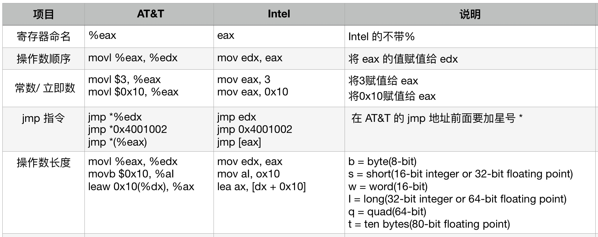
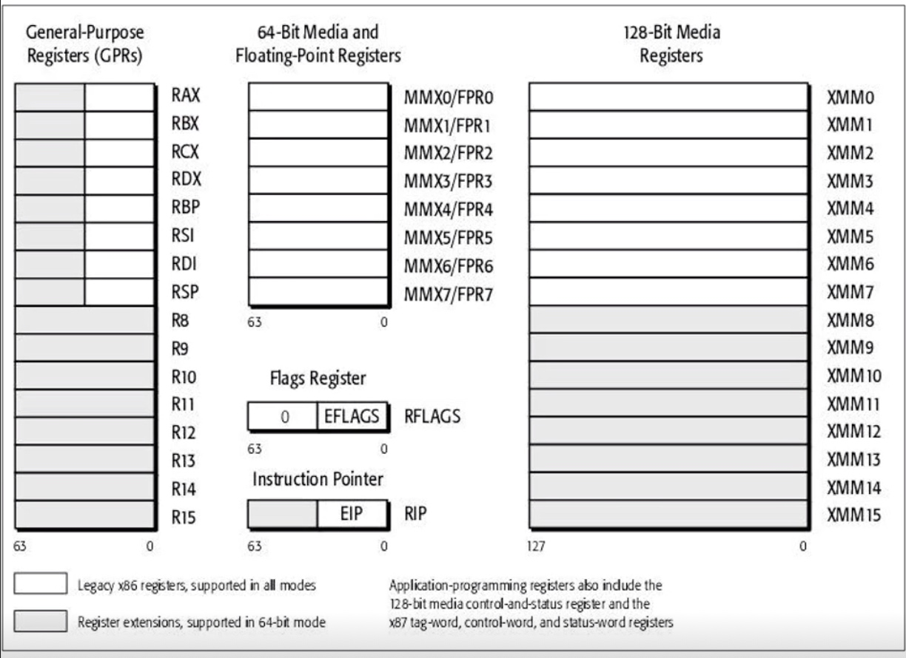
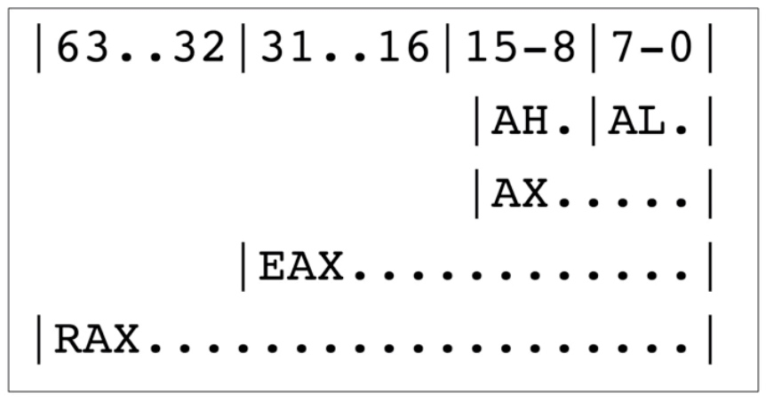
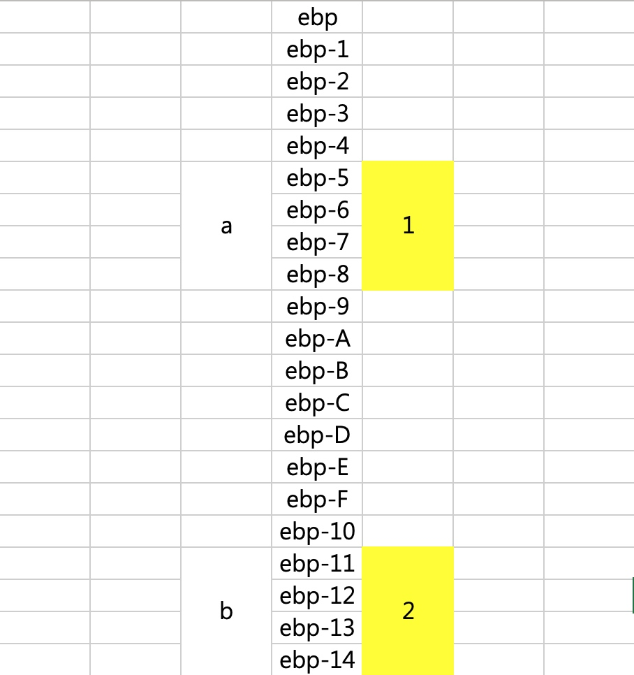
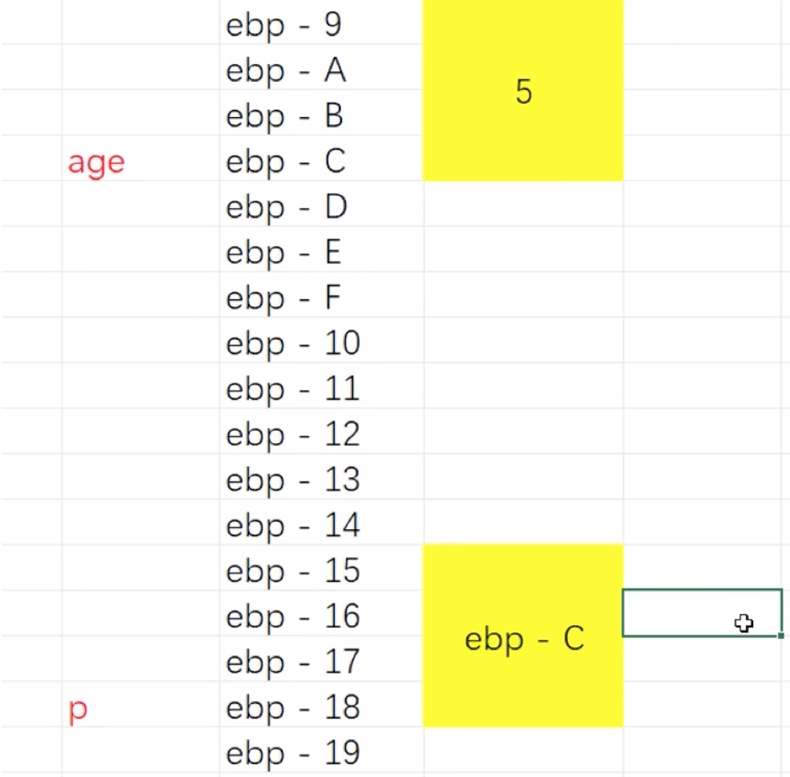

# 汇编基础

### 汇编语言的种类

- 8086汇编 (16bit)
- x86汇编 (32bit)
- x64汇编 (64bit)
    - Intel
    - AT&T 
- ARM 汇编 (嵌入式、移动设备)
- 其他

这里依据 `x64汇编` 举例.`Intel`和`AT&T`只是表现格式不同,表示的意思一样.

汇编中不区分大小写.

### AT&T 汇编 和 Intel 汇编



### 寄存器

X64汇编下寄存器



X64汇编兼容 X86汇编.上面的寄存器在 X86下不叫 `RAX`, 是 `eax`.

`RAX` 寄存器在 X64下,占8个字节.

`eax` 寄存器在 X86 下, 占4个字节.

当 X64要兼容 X86时,比如`RAX`就会从低字节开始拿出4个字节给`eax`使用.



**规律: 
`R`开头的寄存器是64bit 的, 占8个字节 .`e`开头的寄存器是32bit 的,占4个字节**

### 汇编指令

#### 1. `mov dest, src`

- 将 src 的内容复制给 dest.

下面这个:

```C
// 从地址 01333331244H 中取出4个字节的数据,存到 eax 中
mov eax, [01333331244H]
```

#### 2. `[地址值]`

- 中括号中放的是内存地址

#### 3. word

- 表示2个字节

#### 4. dword

- 表示4个字节

#### 5. qword 

- 表示8个字节

#### 6. call 函数地址

- 调用函数

#### 7.lea dest, [地址值]

- 将地址值赋值给 dest,类似 dest = 地址值

#### 8.ret

- 函数返回

#### 9. xor op1, op2

- 将`op1`和`op2`异或的结果赋值给`op1`.
- 类似op1 = op1 ^ op2

#### 10. add op1, op2

- 类似 op1 = op1 + op2

#### 11. sub op1, op2

- 类似 op1 = op1 - op2

#### 12. inc op

- 自增, 类似 op = op + 1

#### 13. dec op

- 自减, 类似 op=op-1

#### 14. jmp 内存地址

- 跳到某个内存地址去执行代码
- `j`开头一般都是跳转.

#### 15. cmp eax, ebx

- 比较这两个寄存器的值

### 通过一个简单的函数分析其汇编实现过程

如下面一个函数

```c++
int main() {
    int a = 1;
    int b = 2;
    int c = a + b;
}
```

编译器当程序编译的时候,就会估算出这个函数需要多少空间,当执行这个函数的时候,内存中已经分配好了一段连续的空间给这个函数.而不是执行`int a = 1`才开始为 `a` 分配内存空间.

上面的代码对应的汇编代码如下:

```c++
mov dword ptr [ebp-8],1
mov dword ptr [ebp-14h],2
mov eax,dword ptr [ebp-8]
add eax,dword ptr [ebp-14h]
mov dword ptr [ebp-20h],eax
```

分析下上面的汇编代码并看下内存图.

- `a`的内存地址就是 `ebp-8`, 且`a`是`int`类型, 占`4`个字节,所以内存中是`从 ebp-8 起往高地址走的4个字节`(如0x100, 0x101, 0x102, 0x103).
- `b`的内存地址是`ebp-14`
- `mov eax,dword ptr [ebp-8]` : 将内存地址`ebp-8`中的东西(`1`)取出来放入寄存器`eax`中.
- `add eax,dword ptr [ebp-14h]`: 将内存地址`ebp-14h`中的东西(`2`)取出来,和寄存器`eax`中的值`1`相加后,并将结果存入寄存器`eax`中.则此时`eax`寄存器中的值就是`3`.
- `mov dword ptr [ebp-20h],eax` :将寄存器`eax`中的值`3`取出来,放到内存地址为`ebp-20h`中去.
- 可见`ebp-20h`就是`c`的内存地址.



## 有指针后,汇编如何实现?

#### 看指针
上面的代码很简单,下面的代码出现指针了,那么其汇编代码又是怎么样的呢?

```c++
int age = 5;
int *p = &age;
```

看下上面代码的反汇编实现:

```c
mov dword ptr [ebp-0Ch],5
lea eax,[ebp-0Ch]
mov dword ptr [ebp-18h],eax
```

分析汇编并看下上述代码在内存中的分布情况:

- `a`的内存地址就是`ebp-0Ch`.
- `lea` 是将 `ebp-0Ch`地址值直接赋值给`eax`.
- 将寄存器`eax`中的东西(`ebp-0Ch`)取出来放到`ebp-18h`中.
- `ebp-18h`就是指针 p 的地址值.
- 额外说明
    - 用`mov`挪东西必须通过寄存器
    - 本例指针以32位4字节为例.


 

#### 看指针如何修改东西的

```c++
int age = 5;
int *p = &age;
*p = 6;
```

看这个汇编

```c
mov dword ptr [ebp-0Ch],5
lea eax,[ebp-0Ch]
mov dword ptr [ebp-18h],eax

mov eax,dword ptr [ebp-18h]
mov dword ptr [eax],6

```

分析汇编

- `mov eax,dword ptr [ebp-18h]` 将内存地址`ebp-18h`(就是指针 p)中存的东西拿出来放到寄存器`eax`中.也就是将`ebp-0Ch`放到寄存器`eax`中.
- `mov dword ptr [eax],6` 将`6`放到内存地址`ebp-0Ch`中,就是将`6`赋值给`age`.

## 引用的本质是什么?

> 引用的本质就是`指针`.

首先看下面引用的代码:

```c++
int main() {
    int age = 10;
    int &rAge = age;
    rAge = 20;
    
    cout << "sizeof(age)" << endl;
    cout << "sizeof(rAge)" << endl;
    
}

// 打印都是: 4
```

- 上面的代码打印结果都是`4`.
- 因为 `rAge` 就是`age`的引用,就是一个`别名`.所以说其实打印的都是`age`.

看下这个结构体:

```c++
struct Student {
    int age;
    int height;
    int *width;
};

int main() {
    cout << sizeof(Student) << endl;
}

// 打印结果 : 16. 因为int 占4, 指针占8.
```

下面将上面结构体的加个引用.

```c++
struct Student {
    int &age;
    int height;
    int *width;
};

int main() {
    cout << sizeof(Student) << endl;
}

// 打印: 24.
// 引用其实占8个,这里有内存对齐,补了4个.
```

只用一个成员看看:

```c++
struct Student {
    int &age;
};

int main() {
    cout << sizeof(Student) << endl;
}

// 打印: 8
```

看下面这个代码的汇编是什么样的?

```c++
int main() {
    int age = 5;
    int &rAge = age;
    rAge = 6;
}
```

其对应的汇编如下:

```c
mov dword ptr [rbp+4],5
lea rax,[rbp+4]
mov qword ptr [rbp+28h],rax
mov rax,qword ptr [rbp+28h]
mov dword ptr [rax],6
```

这个汇编,和指针的汇编代码一模一样的.所以说引用的本质就是指针.

#### 当常指针指向了不同类型的数据时,会产生临时变量,即引用指向的并不是初始化时的那个变量:

看下面两个代码的打印结果:

```c++
#include <iostream>
using namespace std;

int main () {
    
    int age = 10;
    const int &rAge = age;
    age = 30;
    
    cout << "age is = " << age << endl;
    cout << "rAge is = " << rAge << endl;
    
    return 0;
    
}

// 因为常引用不能修改了,就是说不能通过rAge 修改 age 的值.
// 但是 age 本身是变量,可以改的.
// rAge 本身就是个指针,引用的本身就是指针, age 改了之后,它还是指向着 age, 所以打印还是30.


// 打印结果:
age is = 30
rAge is = 30
```

将上面的代码改动一下, 再看打印结果,分析为什么打印结果变了?

```c++
int main () {
    
    int age = 10;
//    const int &rAge = age;
    const long &rAge = age;
    age = 30;
    
    cout << "age is = " << age << endl;
    cout << "rAge is = " << rAge << endl;
    
    return 0;
    
}

// 打印结果:
age is = 30
rAge is = 10
```

其汇编如下:

```c
mov dword ptr [ebp-oCh],0Ah
mov eax,dword ptr [ebp-0Ch]
mov dword ptr [ebp-24h],eax
lea ecx,[ebp-24h]
mov dword ptr [ebp-18h],ecx
mov dword ptr [ebp-0Ch],1Eh
```

上面的汇编其实就像下面的代码:

```c++
int age = 10;
int temp = age;
const long &rAge = temp;
age = 30;
```

