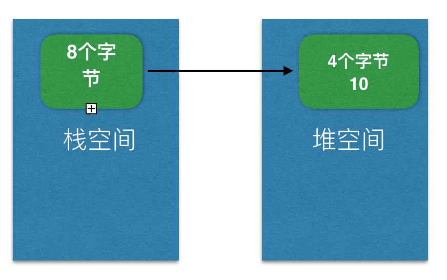
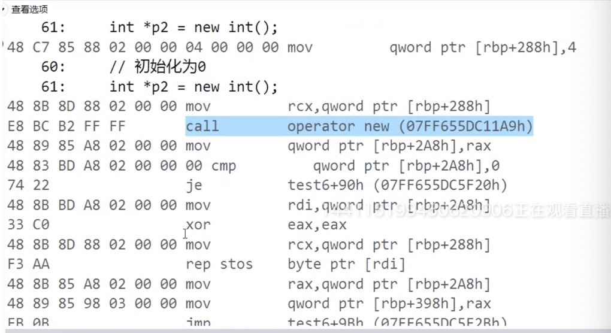

# Part 5

### 封装

将类的成员变量私有化,提供公共的 getter 和 setter 函数给外界去访问成员变量.

```c++
struct TYPerson {
private:
    int m_age;
public:
    void setAge(int age) {
        if(age<0) return;
        this->m_age = age;
    }
    
    int getAge() {
        return this->m_age;
    }
    
};
```

### 内存空间的布局

每个应用都有自己独立的内存空间,一般会有以下的几大区域(下面不分内存地址高低排序):

- 栈空间
    - 每调用一个函数就会给它分配一段连续的栈空间,等函数调用完毕后会自动回收这段栈空间.
    - 自动分配和回收 
- 堆空间
    - 需要主动去申请和释放 
- 代码区
    - 存放代码 
- 全局区
    - 存放全局变量
    - 在 `C/C++` 中,定义在函数外面的就是全局变量.
    - 全局变量的特点: 整个程序运行过程中都存在.程序结束后回收.

### 堆空间

我们通过堆空间可以控制内存的生命周期.

#### 1. 堆空间的申请和释放.

有2种,但是在`c++`中更推荐使用`new`,因为它比`malloc`多做很多事情,比如会主动调用类的构造函数.

- `malloc`
- `new`

##### malloc / free

申请4个字节大小的堆空间内存:

```c++
malloc(4);
```

申请过后,返回的是申请的空间的内存地址:

```c++
int main () {
    // 申请4个字节空间
    // ✘ 这个写法不对, 要强制转换,告诉内存用什么类型来存.
    int *p = malloc(4);
    
    // √ 正确写法
    // int *p 因为是局部变量,在栈空间
    int *p = (int *)malloc(4);
    
    // 将10放到 p 指向的存储空间中
    *p = 10;
    
    // 释放
    free(p);
}
```

对应的内存结构图:



`malloc` 对应的释放语句:

- `free(void *)`;
- `malloc`一次`free`一次,不要多次 `free`.

##### new / delete

在`c++`中常用的和推荐使用的是这种.

```c++
void test() {
    int *p = new int;
}
```

- `new int;` 会看 `new`的这个类型是多少个字节,然后去申请内存空间
- 这里是4个字节,申请开辟4个字节大小的内存空间.

释放:

```c++
void test() {
    int *p = new int;
    delete p;
}
```

申请和释放`数组`类型的:

```C++
void test1() {
    int *p = new int[10];
    delete[] p;
}
```

- 注意不能直接写`delete p;`, 因为有可能只删了4个字节,所以用 `delete[] p`.


##### malloc/free 和 new/delete 这两种不能混合来使用!

##### 分析下面代码,有什么问题?

```c++
void test() {
    int *p = new int;
    p = new int;
    delete p;
}
```

- 少释放一个,内存泄漏
- 因为开始指针`p`指向了第一个`new int;` 的内存.
- 后来`p`又指向了第2个`new int`.
- 然后释放了第2个,第一个并没有被释放掉.

#### 2. 堆空间的初始化

```c++
void test() {
    int *p = (int *)malloc(4);
    cout << *p << endl;
}

// 打印 -89989799 垃圾数据
```

- `*p`是取出这个`malloc(4)`申请的内存空间的东西,但是因为没有被初始化,就是说这个空间之前还有可能被使用过.所以打印的是垃圾数据.
- 所以我么在申请一个空间之前,要对其初始化操作,清0;

##### memset(void *, int , size_t ) 函数

```c++
void test() {
    int *p = (int *)malloc(4);
    // 从 p 这个地址开始的4个字节都存0
    memset(p, 0, 4);
    cout << *p << endl;
    
    // 释放
    free(p);
}
```

##### 看下面的初始化情况

```c++
void test() {

    // 没有初始化
    int *p1 = new int;
    
    // 初始化为0
    int *p2 = new int();
    
    // 初始化为5
    int *p3 = new int(5);
    
    // 没有初始化
    int *p4 = new int[3];
    
    // 全部元素初始化为0
    int *p5 = new int[3]();
    
    // 全部元素初始化为0
    int *p6 = new int[3]{};
    
    // 首元素初始化为5, 其他元素初始化为0
    int *p7 = new int[3]{5};
}
```

加小括号后,看其汇编说明小括号的作用:调用函数了,并有清0的操作



- `xor eax,eax` 两个相同的异或就是0, 这步是清0的操作.

大括号`{}`只用在数组中.


##### 对象的内存

在`C++`中对象可以放在如下几个区域中:

- 全局区
- 栈空间
- 堆空间

```c++
// 全局区
TYPerson g_person;

int main() {
    // 栈空间
    TYPerson person;
    
    // 堆空间
    TYPerson *p = new TYPerson();
}
```

`malloc` 的写法,不推荐,推荐使用 `new`

```c++
TYPerson *p2 = (TYPerson *)malloc(sizeof(TYPerson));
free(p2);
```

### 构造函数

构造函数,也叫构造器.在对象创建的时候,`自动调用`. 一般用来完成对象的初始化工作.

构造函数的特点:

- 函数名与类`同名`,`无返回值(void 都不能写)`, 可以有参数, 可以重载, 可以有多个构造函数.

```c++
struct TYPerson {
    TYPerson() {
        cout << "TYPerson()" << endl;  
    }
};
```

```c++
// 重载的
struct TYPerson {
    int m_age;
    
    TYPerson() {
       cout << "TYPerson()" << endl;   
    }
    
    TYPerson(int age) {
        cout << "TYPerson(int age)" << endl;  
    }
    
};

```

当执行`TYPerson person(20)` 和 `TYPerson person` 会调用上面的对应的方法.

- 一旦定义了构造函数,必须用其中一个自定义的构造函数来初始化对象.

- 通过`malloc`分配的对象不会调用构造函数.

```c++
// 这个通过 malloc 分配的就不会调用构造函数
TYPerson *p = (TYPerson *)malloc(sizeof(TYPerson));
```

所以说`new`比`malloc`多做了很多事情,主动调用构造函数就是其中一项.

- 默认情况下,当我们没有写构造函数的时候,编译器在`某些特定的情况下`,才会为类生成空的无参的构造函数.
    - 注意,不是所有情况都会生成!

#### 默认情况下,成员变量的初始化操作


```c++
struct TYPerson {
    int m_age;
};

// 全局区 (成员变量初始化为0)
TYPerson g_p1;

int main() {
    // 栈空间 (成员变量不会被初始化)
    TYPerson p1;
    
    // 堆空间
    TYPerson *p2 = new TYPerson;             // 成员变量不会被初始化
    TYPerson *p3 = new TYPerson();           // 成员变量初始化为0
    TYPerson *p4 = new TYPerson[3];          // 成员变量不会被初始化
    TYPerson *p5 = new TYPerson[3]();        // 3个 TYPerson 对象的成员变量都初始化为0
    TYPerson *p6 = new TYPerson[3]{};        // 3个 TYPerson 对象的成员变量都初始化为0
    
    return 0;
}
```

#### 自定义构造函数的情况下, 除了全局区,其他内存空间的成员变量默认都不会被初始化,需要开发人员手动初始化.

